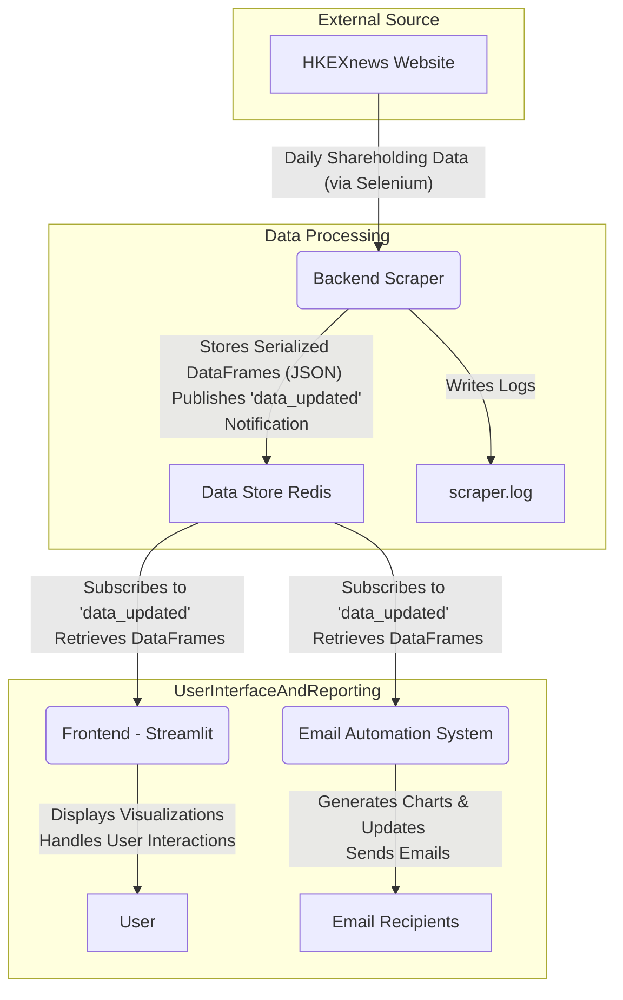

# HKEX Daily Shareholding Reporting System

## Project Goal

This project aims to provide a real-time Streamlit visualization dashboard & email automation system to display and analyze stock shareholding data scraped from the HKEXnews website. It allows users to track daily shareholding information and identify trends and significant changes.



## System Architecture

The system is composed of Four main components:

1.  **Backend Scraper (Python):** A Python application responsible for continuously scraping daily shareholding data from the HKEXnews website. It uses Selenium for web interaction.
2.  **Data Store (Redis):** Redis serves as the primary database and cache. It stores the scraped shareholding data (Pandas DataFrames serialized as JSON) with dates as keys. The backend publishes update notifications to a Redis channel.
3.  **Frontend (Streamlit):** A Streamlit web application that subscribes to Redis updates and visualizes the data. It offers interactive charts, including time-series line charts for individual stock shareholdings and bar charts for top/bottom movers based on customizable criteria.
4. **Email Automation:** A Email Automation System that receives updates from the backend, and generates charts and updates to recipients. 

## Features

### Backend Scraper:
* Automated daily scraping of shareholding data.
* Configurable scraping frequency (default: every minute, toggleable).
* Initial population of historical data (past 60 days).
* Robust error handling with retries and detailed logging to `scraper.log`.
* Data stored in Redis with "YYYY-MM-DD" keys and DataFrame values.
* Publishes notifications to Redis channel `data_updated` upon new data.
* Selenium WebDriver management encapsulated within a class.

### Data Store (Redis):
* Stores daily shareholding DataFrames.
* Data serialized as JSON for efficient storage and retrieval.
* No data expiration (retains all historical data).
* Supports Pub/Sub mechanism for real-time frontend updates.

### Frontend (Streamlit):
* Real-time data updates via Redis Pub/Sub.
* **Line Chart:**
    * Displays 'Shareholding in CCASS' over time for a selected stock.
    * Stock selection via a searchable dropdown (by Name or Code).
* **Bar Chart (Top/Bottom Movers):**
    * Displays top/bottom N stocks based on shareholding changes.
    * Customizable change period (1, 5, 20 days).
    * Customizable change metric (% or absolute number of shares).
    * Customizable display scope (Top 5/10, Bottom 5/10).
    * Handles missing data for change calculations by using the closest available previous trading day.
* User-friendly interface with controls in the sidebar.
* Graceful error handling for data unavailability or connection issues.

### Email Automation:
* Real time updates from Backend server via Redis Pub/Sub
* Generates Top and bottom movers chart
* Display new additions to the Southbound db

## Setup and Installation

### Prerequisites
* Python (version 3.8+ recommended)
* Redis server installed and running.
* Google Chrome browser installed (the scraper uses headless Chrome).
* ChromeDriver (Selenium WebDriver will attempt to manage this automatically if `selenium-manager` is available, otherwise ensure it's in your PATH and compatible with your Chrome version).

### Installation Steps

1.  **Clone the Repository:**
    ```bash
    git clone <your-repository-url>
    cd <your-repository-name>
    ```

2.  **Create and Activate a Virtual Environment (Recommended):**
    ```bash
    python -m venv venv
    # On Windows
    venv\Scripts\activate
    # On macOS/Linux
    source venv/bin/activate
    ```

3.  **Install Dependencies:**
    Create a `requirements.txt` file with the following content (or add specific versions as needed):
    ```
    streamlit
    pandas
    redis
    selenium
    plotly
    requests
    smtplib
    email
    matplotlib
    # Add any other specific libraries used
    ```
    Then install them:
    ```bash
    pip install -r requirements.txt
    ```

4.  **Configure Redis:**
    Ensure your Redis server is running. By default, the applications will try to connect to `localhost:6379`. If your Redis configuration is different, you may need to update the connection parameters in the backend scraper and frontend scripts (or use a configuration file/environment variables as implemented).

5.  **Configure Scraper (Optional):**
    * **Scraping Toggle & Interval:** The scraping frequency (default: 1 minute) and the toggle to enable/disable continuous scraping should be configurable. This might be managed via a `config.ini` file or environment variables (e.g., `SCRAPING_ENABLED=True`, `SCRAPING_INTERVAL_SECONDS=60`). Refer to the specific implementation.

4.  **Configure Env file:**
    Ensure your email credentials are in the environment file, which can be loaded by the `email_automation.py file`. 

## Running the Application

1.  **Start Redis Server:**
    If not already running, start your Redis server.
    ```bash
    redis-server
    ```
    (The command might vary based on your Redis installation.)

2.  **Run the Backend Scraper:**
    Navigate to the directory containing the backend scraper script (e.g., `backend_scraper.py`) and run it:
    ```bash
    python backend_scraper.py
    ```
    Check `scraper.log` for logging output and any errors. The scraper will first populate historical data (60 days) and then start its continuous scraping routine if enabled.

3.  **Run the Streamlit Frontend:**
    Navigate to the directory containing the Streamlit frontend script (e.g., `app.py` or `frontend_streamlit.py`) and run it:
    ```bash
    streamlit run app.py
    ```
    Open your web browser and go to the local URL provided by Streamlit (usually `http://localhost:8501`).

3.  **Run the Email Automation System:**
    Navigate to the directory containing the email automation script (e.g., `email_automation.py`) and run it:
    ```bash
    python email_automation.py
    ```

## Logging
The backend scraper logs its activities, errors, and retry attempts to `scraper.log` in the same directory where the scraper script is run.

## Proposed Enhancements & New Requirements

The following table details the proposed changes, categorizing them by component and impact.

| ID  | Category             | Requirement / Enhancement Description                                                                                                   | Priority | Deliverable(s)                                                                                                                               | Justification                                                                                                                                                                                               |
|-----|----------------------|-----------------------------------------------------------------------------------------------------------------------------------------|----------|----------------------------------------------------------------------------------------------------------------------------------------------|-----------------------------------------------------------------------------------------------------------------------------------------------------------------------------------------------------------|
| **Backend Scraper (B)** |                      |                                                                                                                         |          |                                                                                                                                              |                                                                                                                                                                                                           |
| B01 | Resilience           | **Replace hardcoded `time.sleep()` with `WebDriverWait` and `expected_conditions`** for all dynamic element interactions.                   | Critical | Updated scraper logic in `backend.py`.                                                                                                         | Improves scraper stability against varying page load times, reduces unnecessary delays, and prevents premature failures.                                                                        |
| B02 | Resilience           | **Implement more resilient Selenium selectors** (e.g., dynamic XPath, `data-*` attributes if available) instead of relying solely on IDs, class names, and fixed indices. | High     | Updated scraper logic in `backend.py`.                                                                                                         | Reduces likelihood of scraper failure due to minor HKEX website HTML structure changes.                                                                                                       |
| B03 | Error Handling       | **Differentiate scraper error types** (e.g., "No Data on HKEX" vs. "Scraper Logic/Site Changed Error") instead of generic `None` return for `get_data_from_date`. | High     | Modified `get_data_from_date` return signature (e.g., tuple with status) or custom exceptions. Updated calling functions to handle new statuses. | Allows for more intelligent responses to failures (e.g., halt and alert on critical site changes vs. continue on "no data").                                                                 |
| B04 | Robustness           | **Enhance WebDriver lifecycle management** to ensure re-initialization if driver crashes outside explicit retry blocks.                   | Medium   | Wrapper function/decorator for driver interactions or more pervasive checks.                                                                 | Increases robustness against unexpected driver crashes.                                                                                                                                                     |
| B05 | Logic                | **Correct initial population logic** to strictly use the `INITIAL_POP_MARKER_KEY` to prevent redundant scraping.                        | High     | Updated main execution block in `backend.py`.                                                                                                  | Prevents unnecessary resource consumption and re-scraping of historical data on every script start.                                                                                             |
| B06 | Data Integrity       | **Dynamically parse table column headers or add validation** for expected column count/names instead of hardcoding `df.columns = [...]`. | Medium   | Updated data parsing logic in `backend.py`.                                                                                                    | Protects against data misalignment or errors if HKEX table structure changes.                                                                                                                   |
| B07 | Resource Management  | **Implement a circuit breaker pattern** for continuous scraping to prevent endless retries on persistent failures.                        | Medium   | Modified `run_continuous_scraper` loop in `backend.py`.                                                                                        | Prevents resource exhaustion (CPU, network) if the target site is permanently changed or inaccessible.                                                                                              |
| **Frontend (F)**        |                      |                                                                                                                         |          |                                                                                                                                              |                                                                                                                                                                                                           |
| F01 | State Management     | **Simplify/Review `latest_df_cache`** in session state to ensure it's not redundant with `@st.cache_data` and doesn't introduce complexity. | Medium   | Refactored data loading logic in `frontend.py`.                                                                                                | Reduces complexity and potential for subtle state-related bugs. Ensures reliance on Streamlit's caching mechanisms where appropriate.                                                               |
| F02 | UX / Error Reporting | **Propagate critical Pub/Sub listener errors to the UI** (e.g., using `st.toast` or persistent `st.error`) beyond console prints.        | Medium   | Modified `redis_pubsub_listener` to communicate persistent error states to the main app.                                                     | Provides users with more insight into why live updates might be failing, beyond generic "reconnecting" messages.                                                                                |
| F03 | Robustness           | **Replace broad `except Exception: pass`** in default stock selection with specific exception handling.                                   | Low      | Updated `default_stock_index_line` logic in `frontend.py`.                                                                                     | Prevents silent swallowing of unexpected errors during UI initialization.                                                                                                                           |
| F04 | Configuration        | **Make data lookback windows configurable** (e.g., for movers `+10`, `+7` days) rather than fixed magic numbers.                      | Low      | Add new configuration constants in `frontend.py` or central config.                                                                            | Allows easier adjustment for extended market closures or different analytical preferences.                                                                                                        |
| F05 | Data Consistency     | **Align "Newly Added Stocks" definition/presentation** with `email_automation.py` or clarify differences if intentional.                | Medium   | Modified `get_newly_added_stocks_df` or UI text in `frontend.py`.                                                                                | Ensures consistent understanding of "new" stocks across different system outputs.                                                                                                                   |
| **Email Automation (E)**|                      |                                                                                                                         |          |                                                                                                                                              |                                                                                                                                                                                                           |
| E01 | Resilience           | **Implement iterative Pub/Sub reconnection with exponential backoff** instead of recursive calls.                                       | High     | Refactored `listen_for_updates` method in `email_automation.py`.                                                                               | Prevents `RecursionError` during prolonged Redis outages and provides a more robust reconnection strategy.                                                                                        |
| E02 | Maintainability      | **Consider a templating engine (e.g., Jinja2) for HTML email generation** if complexity is expected to grow.                           | Low      | (Optional) Refactor `_generate_email_content` in `email_automation.py`.                                                                        | Improves maintainability and readability of HTML email code for more complex layouts.                                                                                                               |
| E03 | UX / Clarity         | **Improve email contextual information** when parts of the analysis are missing due to data unavailability (e.g., explain why movers are absent). | Medium   | Enhanced logic in `_generate_email_content` to add more descriptive text.                                                                    | Provides clearer explanations to email recipients about data gaps and their impact on the report.                                                                                                   |
| E04 | Robustness           | **Remove or make configurable the hardcoded `server.ehlo('Gmail')`**.                                                                   | Low      | Modified `_send_email` in `email_automation.py`.                                                                                               | Improves compatibility with non-Gmail SMTP servers.                                                                                                                                                 |
| **Cross-Cutting (C)**   |                      |                                                                                                                         |          |                                                                                                                                              |                                                                                                                                                                                                           |
| C01 | Maintainability      | **Centralize all shared configurations** (Redis details, channel names, etc.) into a single `config.py`, `.env` file, or `config.ini`.    | Critical | New `config.py` or enhanced `.env` usage. All modules updated to read from central config.                                                   | Drastically improves maintainability and reduces errors when updating configurations. `python-dotenv` should be used consistently.                                                                    |
| C02 | Quality Assurance    | **Develop a suite of automated tests (unit and integration).**                                                                            | High     | New `tests/` directory with Pytest (or similar) test files covering core logic, data processing, and mocked external interactions.        | Ensures code quality, facilitates refactoring, prevents regressions, and validates core functionality reliably.                                                                                     |
| C03 | Reproducibility    | **Generate and maintain an accurate `requirements.txt`** using `pip freeze > requirements.txt`.                                           | High     | Updated `requirements.txt` file in the repository.                                                                                             | Ensures that the project can be reliably set up in different environments with correct dependency versions.                                                                                           |
| C04 | Observability        | **Standardize logging across all components.** Consider structured logging for easier parsing if logs are centralized.                  | Medium   | Consistent use of Python's `logging` module in `frontend.py`'s background tasks. Potentially adopt structured logging libraries.         | Improves troubleshooting and monitoring capabilities, especially for background processes in the frontend.                                                                                            |
| C05 | Documentation        | **Update README.md** to reflect all changes, new configurations, and testing procedures.                                                | High     | Updated `README.md`.                                                                                                                           | Keeps project documentation current and useful for developers and users.                                                                                                                              |
| C06 | Scraper Scalability  | **Investigate options for parallelizing historical scraping** if performance becomes an issue for very large backfills.                 | Low      | (Research task) Design document for parallel scraping architecture (e.g., using multiple driver instances, worker pools).                | Prepares for potential future needs if scraping large amounts of historical data becomes too time-consuming.                                                                                          |

## Risks & Mitigation

| Risk                                                    | Likelihood | Impact | Mitigation Strategy                                                                                                                              |
|---------------------------------------------------------|------------|--------|--------------------------------------------------------------------------------------------------------------------------------------------------|
| HKEX website undergoes major structural overhaul.       | Medium     | High   | B02 aims to make selectors more resilient. C02 (testing) will help quickly identify breaks. Continuous monitoring of scraper health is essential. |
| Changes in Redis API or `streamlit` behavior.           | Low        | Medium | C02 (testing) and C03 (`requirements.txt` with pinned versions) help mitigate unexpected behavior from dependency updates.                       |
| SMTP server configuration issues or email blacklisting. | Medium     | Medium | E04 makes SMTP more generic. Clear logging in email sending. Monitoring bounce rates if deployed in production.                                    |


## Contributing
Feel free to fork it for your own use.
