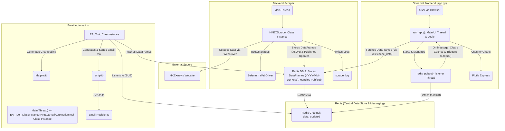

Code Architecture

```mermaid
graph TD
    subgraph ExternalSource ["External Source"]
        HKEX["HKEXnews Website"]
    end

    subgraph DataIngestion ["Backend Scraper"]
        BS_Main("Main Thread") --> BS_HKEXScraper_ClassInstance("HKEXScraper Class Instance")
        BS_HKEXScraper_ClassInstance -- "Uses/Manages" --> BS_WebDriver("Selenium WebDriver")
        BS_HKEXScraper_ClassInstance -- "Scrapes Data via WebDriver" --> HKEX
        BS_HKEXScraper_ClassInstance -- "Stores DataFrames (JSON) & Publishes Updates" --> R_DB
        BS_HKEXScraper_ClassInstance -- "Writes Logs" --> BS_Log("scraper.log")
    end

    subgraph DataStorageAndMessaging ["Redis (Central Data Store & Messaging)"]
        R_DB("Redis DB 3: Stores DataFrames (YYYY-MM-DD keys), Handles Pub/Sub")
        R_PubSubChan("Redis Channel: data_updated")
        R_DB -- "Notifies via" --> R_PubSubChan
    end

    subgraph EmailReporting ["Email Automation"]
        EA_Main("Main Thread) --> EA_Tool_ClassInstance("HKEXEmailAutomationTool Class Instance)
        EA_Tool_ClassInstance -- "Listens to (SUB)" --> R_PubSubChan
        EA_Tool_ClassInstance -- "Fetches DataFrames" --> R_DB
        EA_Tool_ClassInstance -- "Generates Charts using" --> EA_Matplotlib("Matplotlib")
        EA_Tool_ClassInstance -- "Generates & Sends Email via" --> EA_SMTPLib("smtplib")
        EA_SMTPLib -- "Sends to" --> EA_Recipients("Email Recipients")
    end

    subgraph WebDashboard ["Streamlit Frontend (app.py)"]
        ST_MainApp("run_app(): Main UI Thread & Logic")
        ST_User("User via Browser") <--> ST_MainApp
        ST_MainApp -- "Starts & Manages" --> ST_PubSubThread("redis_pubsub_listener Thread")
        ST_PubSubThread -- "Listens to (SUB)" --> R_PubSubChan
        ST_PubSubThread -- "On Message: Clears Caches & Triggers st.rerun()" --> ST_MainApp
        ST_MainApp -- "Fetches DataFrames (via @st.cache_data)" --> R_DB
        ST_MainApp -- "Uses for Charts" --> ST_Plotly("Plotly Express")
    end
```